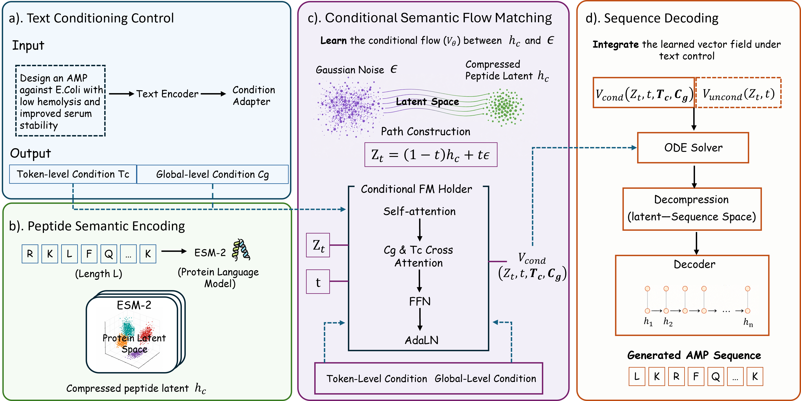

# TC-SRF-AMP

Text-conditioned semantic rectified flow for controllable antimicrobial peptide generation.

This repository provides the implementation, evaluation scripts, and reproducibility notes for a strict text-conditioned AMP generator:

```text
natural language -> structured prompt -> SciBERT -> T_c + c_g -> conditional semantic flow -> decoder -> AMP sequence
```

The reported strict path uses text-derived token and global conditions only. Direct label IDs and direct attribute IDs are not supplied to the model during strict training or generation.



## Model Assets

Large checkpoints, pretrained encoder weights, and full retraining data are hosted on Hugging Face:

[Canana040217/tc-srf-amp-models](https://huggingface.co/Canana040217/tc-srf-amp-models/tree/main)

Download them into the expected repository layout:

```bash
git clone https://github.com/canwang217/TC-SRF-AMP.git
cd TC-SRF-AMP
conda env create -f prot_flow/environment.yaml
conda activate tc-srf-amp
python prot_flow/scripts/download_models.py
```

The canonical final checkpoint is:

```text
prot_flow/checkpoints/tc_srf_amp_strict_frozen_text_10k/tc_srf_amp_finetune_last_.pth
```

## Dataset

The phase 1 ensemble dataset is included directly in this repository under `data/phase_1/`:

```text
data/phase_1/ensemble_train.jsonl
data/phase_1/ensemble_test.jsonl
```

To obtain the dataset, clone this repository:

```bash
git clone https://github.com/canwang217/TC-SRF-AMP.git
cd TC-SRF-AMP
```

The files are newline-delimited JSON (`.jsonl`), with one record per line. They can be read with standard JSONL tooling, for example:

```python
import json
from pathlib import Path

dataset_path = Path("data/phase_1/ensemble_train.jsonl")
with dataset_path.open("r", encoding="utf-8") as handle:
    first_record = json.loads(next(handle))
```

## Quick Generation

```bash
cd prot_flow
python scripts/generate_strict_from_prompt.py \
  --prompt "Generate a short highly cationic antimicrobial peptide rich in lysine and arginine with no cysteine." \
  --num 32 \
  --seed 0 \
  --guidance-scale 4
```

The script prints the parsed structured prompt, generation summary, example sequences, and the JSON output path.

## Method Summary

TC-SRF-AMP generates peptides in a compressed ESM-2 semantic latent space. A peptide sequence is encoded by ESM-2 and compressed into latent tokens. Rectified flow matching learns a vector field between Gaussian noise and the compressed peptide latent. During generation, the learned vector field is integrated under text control, then decompressed and decoded back into an amino-acid sequence.

Text conditioning follows the TC-SRF-AMP route:

- SciBERT encodes the prompt.
- A token projector produces token-level condition `T_c`.
- A global projector produces global condition `c_g`.
- Peptide latent tokens use cross-attention over `T_c`.
- Adaptive layer normalization injects `c_g`.
- Classifier-free guidance combines conditional and unconditional vector-field predictions at sampling time.

The natural-language interface is a rule-based parser that normalizes free text into structured text, for example:

```text
Generate a short highly cationic antimicrobial peptide rich in lysine and arginine with no cysteine.
```

becomes:

```text
activity: active; target: unknown; length_bin: short; charge: high_positive; kr_ratio: high; hydrophobicity: medium; cys: none; toxicity: unknown
```

This structured prompt is still ordinary text input to SciBERT. The parser does not require training and does not add a separate neural condition branch.

## Reproduce Results

Structured prompt evaluation:

```bash
cd prot_flow
bash scripts/run_eval_strict_structured.sh
```

Natural-language parser evaluation:

```bash
cd prot_flow
bash scripts/run_eval_strict_nl_parser.sh
```

Extra physicochemical analysis:

```bash
cd prot_flow
python scripts/analyze_generated_physchem.py \
  --input generated_seqs/diagnostics/strict_nl_parser_g4_fixed/combined.json \
  --output-dir generated_seqs/diagnostics/strict_nl_parser_g4_fixed/physchem \
  --group-key prompt_name
```

## Reported Results

Natural-language prompt benchmark at guidance scale 4:

| Prompt | Parsed condition | Length | Charge | KR | Cys | n |
|---|---|---:|---:|---:|---:|---:|
| short highly cationic | short, high_positive, high KR | 10.14 | +5.07 | 0.536 | 0.053 | 512 |
| long negatively charged | long, negative, low KR | 37.89 | -7.97 | 0.045 | 0.029 | 512 |
| medium hydrophobic | medium, positive, high hydrophobicity | 20.54 | +4.82 | 0.270 | 0.315 | 512 |
| inactive long neutral | long, neutral, low KR | 37.01 | -3.92 | 0.046 | 0.031 | 512 |

Structured-prompt benchmark at guidance scale 4:

| Prompt | Length | Charge | KR | Hydrophobic fraction | Cys | n |
|---|---:|---:|---:|---:|---:|---:|
| active_short_highpos | 9.98 | +5.07 | 0.541 | 0.348 | 0.057 | 1024 |
| active_long_negative | 37.98 | -8.14 | 0.044 | 0.405 | 0.028 | 1024 |
| active_medium_hydrophobic | 20.40 | +4.85 | 0.271 | 0.465 | 0.287 | 1024 |
| inactive_long_neutral | 37.00 | -3.91 | 0.046 | 0.462 | 0.046 | 1024 |

The strongest controls are length, charge direction, KR fraction, and cysteine suppression. Hydrophobicity and neutral charge are weaker and should be handled with candidate generation plus post-generation filtering.

## Repository Layout

```text
assets/figures/      Framework figures used in this README
data/phase_1/        Public phase 1 train/test JSONL dataset
docs/                Reproducibility and method notes
prot_flow/           Core model, training, generation, and evaluation code
results/             JSON/CSV summaries from reported evaluations
structured_amp_summary.json
```

See:

- `docs/QUICKSTART.md` for minimal usage.
- `docs/CODE_MAP.md` for the mapping from paper components to code.
- `docs/MODEL_ASSETS.md` for the Hugging Face asset layout.
- `docs/STRUCTURED_PROMPT_MODULE.md` for natural language parsing.
- `docs/REPRODUCE_FROM_ZERO.md` for retraining and reproducibility.
- `docs/STRICTNESS_NOTE.md` for why legacy attribute parameters exist but are inactive in the strict path.

## Limitations

The current release reports sequence-derived physicochemical controls. It does not include an experimentally validated hemolysis, MIC, target-spectrum, or serum-stability predictor. Generated candidates should be filtered and validated before biological interpretation.

## Citation

The manuscript is in preparation. For now, cite this repository:

```bibtex
@software{Wang2026tcsrfamp,
  title = {TC-SRF-AMP: Text-Conditioned Semantic Rectified Flow for Controllable Antimicrobial Peptide Generation},
  author = {Can, Wang},
  year = {2026},
  url = {https://github.com/canwang217/TC-SRF-AMP}
}
```

## License And Attribution

This repository is released under the MIT License. Parts of the peptide latent pipeline build on ProtFlow-style components; see `NOTICE.md` and `prot_flow/LICENSE`.
